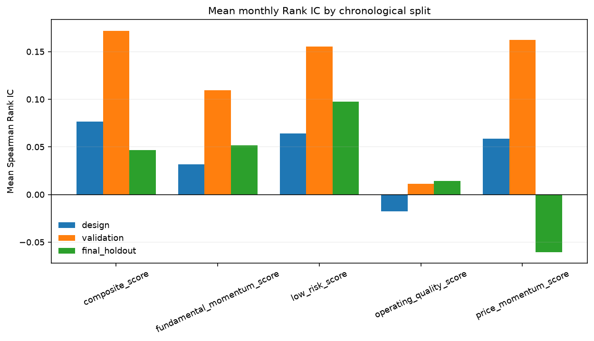
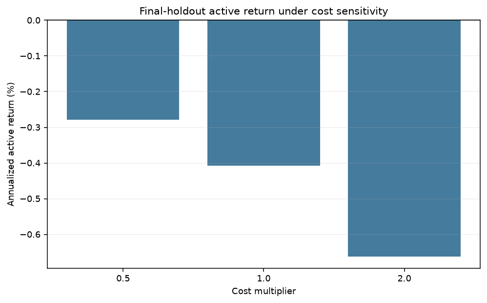
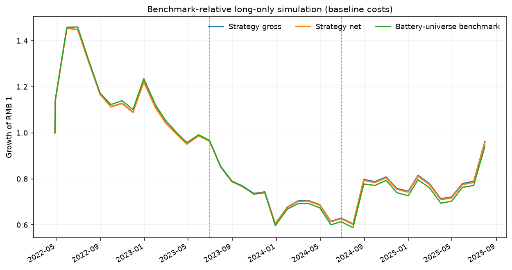

# A-Share Battery-Value-Chain Systematic Equity Research

An independent, post-internship public-data reconstruction of a monthly cross-sectional equity-quant research process. The repository was developed in **2026**; its analytical information cutoff is **29 August 2025**.

> This is not UBS work product, does not contain UBS proprietary data or views, and must not be represented as a model delivered during a 2025 internship.

## Result first

The engineering and research process is reproducible, but the registered composite **does not pass the final-holdout alpha criteria**.

| Final-holdout test | Result | Gate |
|---|---:|---|
| Composite mean monthly Rank IC | 0.047 | Positive, but HAC p = 0.167 and FDR p = 0.208 |
| Equal-weight top-minus-bottom diagnostic | -0.87% per month | Fail |
| Cost-aware long-only annualized active return | -0.41% | Fail |
| Long-only information ratio | -0.43 | Fail |
| Active return at 2× costs | -0.66% annualized | Fail |
| Active return with one additional signal-day lag | -0.45% annualized | Fail |

The correct research conclusion is therefore not “I found alpha.” It is:

> Validation performance did not survive translation from rank correlation to return spreads and a cost-aware long-only portfolio. The baseline composite should be rejected or redesigned using new data and a new untouched holdout.

Negative validation is retained in the repository rather than optimized away.



## Exact role positioning

The new main project is closest to **Systematic Equity Quantitative Research**:

- monthly, medium-frequency cross-sectional stock research;
- a historically changing battery-value-chain universe;
- point-in-time feature construction and forward labels;
- economic signal hypotheses, IC and quantile diagnostics;
- benchmark-relative portfolio construction;
- beta, tracking-error, concentration, turnover and liquidity constraints;
- explicit commissions, spread, stamp duty and nonlinear market impact;
- chronological design, validation and final-holdout periods;
- robustness tests and model-failure rules.

It is **not Quantitative Trading**. There are no intraday quotes, order-book events, execution algorithms, market-making inventory, live orders or realized trading P&L. Calling it QT would be inaccurate.

The older CATL single-name modules remain in the repository as economic context and as an example of why company analysis is not automatically an alpha signal. They are not the systematic strategy.

Read the full [first-person Chinese handbook](docs/first_person_qr_handbook_zh.md), [role-positioning note](docs/role_positioning.md), [claim boundary](docs/claim_boundary.md), [resume wording](docs/resume_and_claim_ledger.md), [AI-assistance disclosure](docs/ai_assistance.md), and [pre-registered signal registry](docs/signal_registry.md).

## Research question

At each month-end, using only information available before execution:

1. Can economically interpretable price, quality, fundamental-momentum and low-risk signals rank the next month's relative returns inside a battery-theme equity universe?
2. Do any ranking results survive an investable, benchmark-relative long-only portfolio with realistic constraints and estimated costs?
3. Are results stable across untouched time periods, higher costs, an additional signal lag and contribution-concentration checks?

The one-month target is

\[
y_{i,t+1}=R_{i,t\rightarrow t+1}-R_{b,t\rightarrow t+1}.
\]

Features stop at the configured signal date. The registered baseline signal date is the trading day before month-end execution; the robustness run moves it back by one more trading day. Returns begin at the execution close and end at the next month-end execution close.

## Data assets and point-in-time controls

### Historical universe proxy

The public baseline uses the top 50 disclosed holdings of ETF 561910, which tracks the CSI New Energy Power Battery Theme Index, at Q2 and Q4 snapshots. It is a delayed public proxy, not an official immutable constituent database.

- Q2 holdings become usable only after a conservative 60-calendar-day delay.
- Q4 holdings become usable only after a conservative 90-calendar-day delay.
- The raw asset contains 400 membership rows and 75 unique historical symbols.
- BSE-listed 920185 is retained in the audit mapping but excluded from the Shanghai/Shenzhen baseline because its microstructure and public price coverage are not comparable.
- Delisted 300116 remains in the historical universe, with Tencent data used after Yahoo fails, to reduce survivorship bias.

### Market and accounting data

- 147,955 daily OHLCV observations from 2017-01-03 through 2025-08-29;
- Yahoo Finance raw and adjusted prices, with a Tencent/AkShare fallback for the delisted name;
- CSI 300 ETF 510300 as the market-beta proxy;
- 3,838 Eastmoney financial-analysis records with report and public notice dates;
- manual broad value-chain groups used only for neutralization and exposure control.

The code rejects duplicate date-symbol rows, impossible prices, negative volume, late membership snapshots and financial records not yet public at the signal date. Public vendor histories may still contain later restatements or backfills; notice-date filtering is not equivalent to owning an immutable historical vendor snapshot.

Content hashes and retrieval metadata are stored in [data/source_manifest.json](data/source_manifest.json). The complete schema and upgrade path are in [data/README.md](data/README.md).

## Registered signals

Signal definitions and directions were frozen in [docs/signal_registry.md](docs/signal_registry.md) before the end-to-end backtest.

| Family | Inputs | Registered direction | Composite weight |
|---|---|---|---:|
| Price momentum | 12–1 and 6–1 adjusted-price momentum | Higher | 25% |
| Operating quality | Profitability, margins and leverage composite | Higher | 25% |
| Fundamental momentum | Revenue/profit growth and change in quality | Higher | 25% |
| Low risk | 63-day total and 126-day idiosyncratic volatility | Lower | 25% |

Every raw descriptor is median/MAD clipped, cross-sectionally standardized, neutralized against log 20-day ADV and broad value-chain groups, then re-standardized. The baseline composite uses equal family weights; no IC-fitted weights or after-the-fact sign changes are allowed.

Beta, liquidity, benchmark weight and industry group are controls—not alpha features. The earlier CATL/lithium contemporaneous regression is not reused as a predictor.

## Chronological evaluation

| Partition | Dates | Labeled months | Use |
|---|---|---:|---|
| Design | through 2023-06-30 | 15 | Develop the registered baseline |
| Validation | 2023-07-01 to 2024-06-30 | 12 | Check generalization once |
| Final holdout | 2024-07-01 to 2025-08-29 | 13 | Untouched final assessment |

The last August 2025 cross-section has no next-month label before the research cutoff and is not scored as a realized return month.

Reported diagnostics include monthly Pearson IC, Spearman Rank IC, ICIR, positive-month ratio, Newey-West mean tests, Benjamini–Hochberg false-discovery-rate control, and equal-weight quantile spreads. Long-short quantiles are research diagnostics only; no historical borrow inventory or fees are available.

The validation period looked strong, especially for momentum, but the final holdout did not preserve the return spread. This is precisely why validation and holdout must be separated.

## Portfolio construction and costs

The implementation simulation is an enhanced-index long-only portfolio, not a short book:

1. start from each delayed battery-universe benchmark snapshot;
2. apply an exponential tilt to the equal-weight composite;
3. preserve broad-group benchmark weights;
4. cap single-name weights at 12% and active weights at ±3%;
5. scale active risk to a 10% ex-ante tracking-error cap and ±0.10 active market beta;
6. enforce a 25% monthly one-way turnover cap and 5% ADV participation cap at RMB100 million assumed AUM;
7. explicitly liquidate removed constituents and include their sale costs;
8. deduct commission, spread, dated sell-side stamp duty and square-root market impact.

The simulation is rerun at 0.5×, 1× and 2× costs. Under baseline costs, average final-holdout one-way turnover is about 5.4% per month and estimated annual arithmetic cost drag is about 17 bps. Results remain negative at double costs.



The final-holdout contribution audit does not reveal a hidden one-name explanation: CATL is the largest contributor by absolute activity, but accounts for only about 7.1% of absolute single-name active contributions. Maximum absolute broad-group active weight is about 1.5 basis points because group neutrality is enforced. This does not rescue the alpha result; it only rules out one simple concentration explanation.



## What the old CATL modules are now used for

The filing-based volume/ASP bridge, conditional market/peer/lithium attribution, six-company operating score and commodity scenarios answer single-company research questions. They are retained as a documented **economic context layer**:

- the 78-week exercise uses the held-out week's realized factor returns and is a conditional-attribution stability test, not a tradable forecast;
- CATL's six-company operating rank is not a validated cross-sectional alpha factor;
- lithium-to-material-cost and customer pass-through assumptions are scenarios, not estimated causal parameters;
- strong operating quality does not imply positive future excess return.

The systematic project turns that last point into a broad-universe falsifiable test—and the current test rejects the baseline composite as persistent alpha.

## Reproduce

Python 3.11 or newer is required.

```bash
python3 -m venv .venv
.venv/bin/python -m pip install -e '.[dev]'

# Download and freeze the public systematic assets.
make systematic-download

# Build signals, run diagnostics, portfolios, robustness tests and reports.
make systematic-run

# Run all unit and integration tests.
make test
```

`make systematic-all` performs all three steps. Public APIs can change, so the committed manifest records the exact hashes used for the reported run. Large raw and processed Parquet files are intentionally ignored; the small audit tables, figures, configuration, code and generated reports are committed.

The legacy single-name pipeline remains available through `make all`.

## Repository map

```text
config/systematic.yaml                    frozen research and portfolio rules
data/manual/systematic_industry_groups.csv analyst-curated controls and exclusions
data/source_manifest.json                 providers, parameters, timestamps and hashes
docs/signal_registry.md                   hypotheses fixed before backtest
docs/role_positioning.md                  QR versus QT and project classification
docs/claim_boundary.md                    internship versus later-project evidence
docs/first_person_qr_handbook_zh.md        first-person Chinese end-to-end derivation
docs/resume_and_claim_ledger.md            resume bullets and evidence ledger
docs/ai_assistance.md                      authorship and tool-assistance boundary
src/catl_quant/systematic_data.py         membership, market and fundamental adapters
src/catl_quant/systematic_features.py     point-in-time monthly feature engine
src/catl_quant/systematic_evaluation.py   IC, HAC/FDR and quantile diagnostics
src/catl_quant/systematic_portfolio.py    risk, turnover, capacity and cost simulation
src/catl_quant/systematic_pipeline.py     deterministic orchestration and reporting
reports/systematic_summary.json           canonical machine-readable result
reports/tables/systematic_*.csv           generated research and audit tables
reports/figures/systematic_*.png          generated charts
reports/generated/systematic_research_report.md generated systematic report
tests/test_systematic_*.py                timing, math, cost and integration controls
```

## Claim and production boundaries

- This is a research simulation, not live trading, production deployment or realized P&L.
- The universe uses delayed ETF holdings, not an official historical index-membership database.
- Public financial histories can be restated or backfilled.
- The sample contains only 40 labeled monthly cross-sections, including 13 final-holdout months.
- Spread, impact and capacity inputs are estimates, not archived executable quotes.
- China A-share limit-up/limit-down queues, suspensions, borrow, taxes beyond the stated stamp duty and operational execution failures are not fully modeled.
- The industry grouping is manual and broad, not an official taxonomy.
- A new signal specification requires a new experiment ID and a new untouched holdout.
- The public repository demonstrates a later independent project. It cannot be used to manufacture an earlier employment history.

For the full generated tables and exact machine-readable values, see [reports/systematic_summary.json](reports/systematic_summary.json) and the [generated systematic report](reports/generated/systematic_research_report.md).
