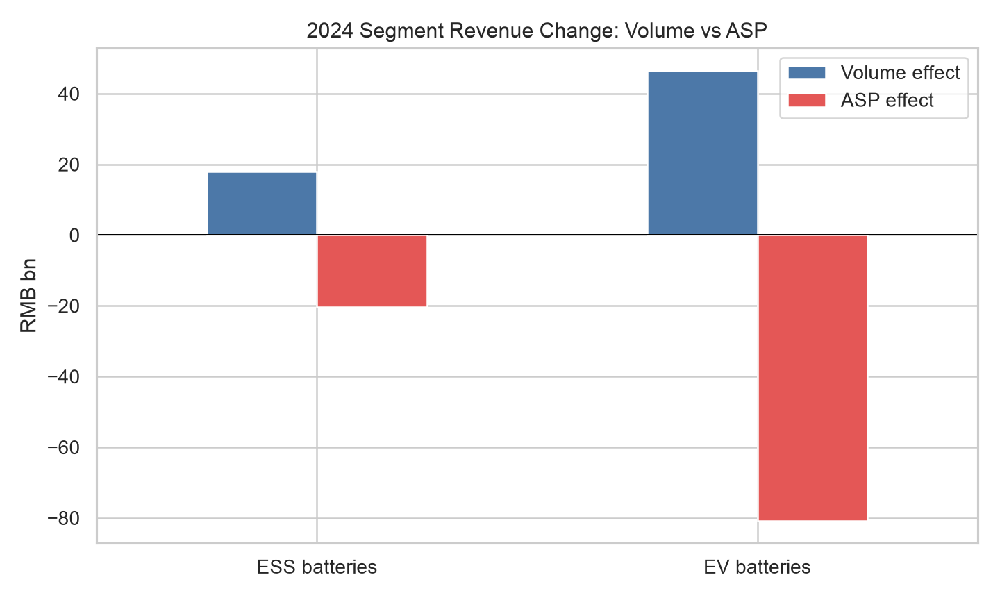
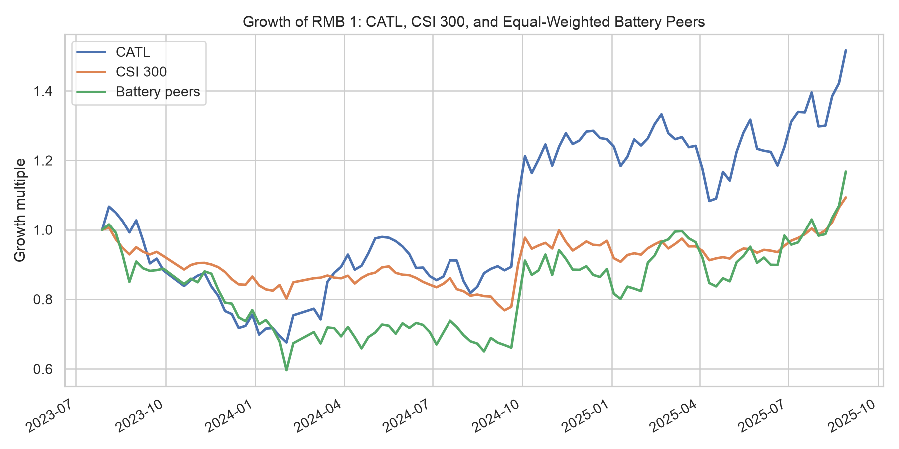
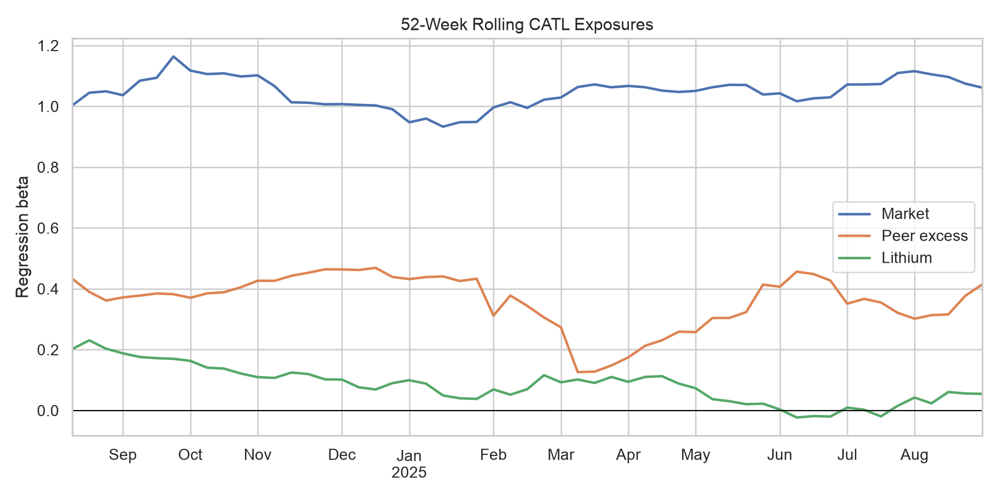
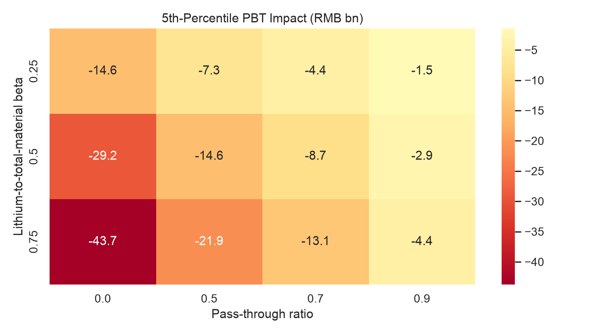

# CATL Quantitative Equity Research

**Research cutoff:** 2025-08-29  
**Role of CATL:** mentor-assigned focal company; the models explain and test CATL rather than claim it was discovered by a screen.

## Executive conclusion

**Investment stance at the cutoff: operating-quality positive, equity view valuation-dependent.** CATL's 2024 revenue pressure was primarily an ASP problem, not a volume problem: battery volumes rose while reported EV and ESS ASPs fell sharply. Direct-material costs fell and segment margins improved. The July 2025 interim report then showed total revenue returning to growth, led by EV batteries, but with a modest year-on-year decline in EV segment margin. The evidence supports operating resilience; without clean point-in-time valuation and consensus-revision data, it does not support an unconditional Buy or target price.

The full weekly return-attribution model explains **62.1%** of in-sample variation. Its lithium coefficient is **0.123** with a HAC p-value of **0.005**. The out-of-sample full-model RMSE is **0.0270**, versus **0.0303** for market-only, equivalent to **20.3%** incremental OOS R-squared. This is evidence that lithium adds conditional equity-return information; it is not evidence that higher lithium prices improve CATL's earnings.

Within the six-company battery-manufacturer comparison set, CATL's 2024 operating score ranks **1/6**. But the three forward Rank IC observations range from **-0.771** to **0.086** and are not robust. The score identifies relative operating quality, not a validated return factor. It deliberately excludes valuation because a clean point-in-time valuation history was unavailable in the public baseline.

## 1. Research design

The project combines four linked layers:

1. revenue and cost decomposition from official CATL filings;
2. weekly CATL return attribution against CSI 300, equal-weighted battery peers, and GFEX lithium carbonate;
3. peer operating-quality validation using only annual reports released by each rebalance date;
4. commodity downside scenarios with explicit pass-through and lithium-to-material-cost assumptions.

The model panel contains **106 weekly observations** from 2023-07-28 through 2025-08-29. No observation after the cutoff is accepted.

## 2. Earnings-driver result

- EV batteries volume effect: RMB 46.5bn (symmetric volume-price decomposition).
- EV batteries ASP effect: RMB -80.7bn (symmetric volume-price decomposition).
- ESS batteries volume effect: RMB 17.9bn (symmetric volume-price decomposition).
- ESS batteries ASP effect: RMB -20.2bn (symmetric volume-price decomposition).

CATL's H-share prospectus reports RMB202.7bn of 2024 direct-material costs, equal to 74.1% of cost of sales. It also gives a no-pass-through sensitivity of approximately RMB2.027bn of pre-tax profit for a 1% average direct-material-price move. This is the calibration anchor for deterministic scenarios; it is not presented as an internally estimated coefficient.

The top-five customers represented 37.03% of revenue. Their disclosed shares contribute 0.0356 to HHI. This is explicitly a **top-five HHI contribution**, not full-company HHI.

## 3. 2025H1 in-internship checkpoint

CATL reported 2025H1 revenue of RMB178.9bn, up 7.27% year on year. EV-battery revenue rose 16.80% to RMB131.6bn, while its gross margin fell 1.07ppt to 22.41%. ESS revenue fell 1.47% to RMB28.4bn, while its margin improved 1.11ppt to 25.52%.

This checkpoint supports a differentiated view: EV demand/revenue momentum improved after 2024's price-led contraction, but margin normalization had begun; ESS retained stronger margin resilience despite softer revenue.

## 4. Equity-return attribution

The regression uses Newey-West/HAC standard errors. The equal-weighted peer factor excludes CATL. Lithium weekly returns are winsorized only at their 1st and 99th percentiles for the regression, while raw observations remain stored.

During the 13-week internship window, CATL's cumulative log return was **20.6%**. The fitted contributions were market **16.4%**, peer excess **3.8%**, lithium **3.2%**, and intercept **5.4%**; the remaining company-specific residual was **-8.3%**. The summer gain was therefore associated mainly with common market/sector/commodity states, while the residual was negative.

Directional accuracy is reported only as a secondary diagnostic: full model **85.7%**, market-only **85.7%**, naive always-positive **57.1%**. RMSE and incremental OOS R-squared are the primary tests.

## 5. Peer-score validation

The peer score uses equal weights across quality, growth, and balance-sheet categories. It is tested against subsequent excess returns from May 1 after annual-report season. With only six direct peers, Rank IC is descriptive evidence, not proof of a production factor.

| report_date   | evaluation_start   | evaluation_end   |   companies |    rank_ic |   p_value |
|:--------------|:-------------------|:-----------------|------------:|-----------:|----------:|
| 2022-12-31    | 2023-05-01         | 2023-10-31       |           6 | -0.771429  | 0.0723965 |
| 2023-12-31    | 2024-05-01         | 2024-10-31       |           6 |  0.0857143 | 0.871743  |
| 2024-12-31    | 2025-05-01         | 2025-08-29       |           6 | -0.485714  | 0.328723  |

The validation does **not** support using the operating score as a standalone long-short signal. That negative result is retained rather than optimized away.

## 6. Commodity scenarios

ADF p-value on weekly log lithium prices: **0.040**. AR(1) out-of-sample RMSE: **0.0608**; random-walk RMSE: **0.0618**. Selected method: **AR(1) log-price simulation**.

The heatmap is conditional. The mapping from a lithium-price shock to total direct-material cost is a scenario beta, and customer pass-through is also a scenario parameter. Neither is mislabeled as a disclosed CATL fact. The AR(1) RMSE advantage over a random walk is small, so the simulated quantiles should be treated as model-sensitive ranges rather than precise forecasts.

## 7. Decision framework

- **Positive evidence:** top-ranked operating quality in the direct peer set, 2025H1 return to revenue growth, and a lower 2024 direct-material burden.
- **Watch items:** EV margin normalization, ESS revenue softness, customer concentration, and the residual share of material shocks not passed through.
- **Equity discipline:** require contemporaneous valuation and earnings-revision data before converting operating strength into a rating or target price.
- **Model discipline:** use market/peer/lithium exposures for attribution and monitoring, not as causal earnings coefficients.

## 8. What can be defended in an interview

- CATL was assigned by the mentor as the focal company.
- The first quantitative finding was pricing pressure despite volume growth.
- The return model separates broad-market, peer-sector, commodity, and residual components.
- The earnings model translates material-cost shocks into conditional PBT impacts using a filing-derived sensitivity anchor.
- The stochastic model is selected by diagnostics; an OU/AR(1) process is not forced when stationarity and out-of-sample tests do not support it.
- The score backtest is validation of a research ranking, not a claim of a profitable trading strategy.

## 9. Data limitations and next upgrade

The public baseline uses Eastmoney/Sina adapters and official CATL filings. A production-quality rerun should replace vendor proxies with point-in-time Wind/Bloomberg market and valuation exports, an SMM/Fastmarkets spot lithium series, and dated monthly industry data. The import contracts are documented in `data/README.md`.

## Sources

- [CATL 2024 Annual Report](https://www.catl.com/uploads/1/file/public/202503/20250317094543_6ig9e0mwng.pdf)
- [CATL 2025 H-share Prospectus](https://www.catl.com/en/uploads/1/file/public/202505/20250512071033_9of2dqw816.pdf)
- [CATL 2025 Interim Report](https://www.catl.com/uploads/1/file/public/202507/20250730224404_1re4ofju1s.pdf)
- [GFEX historical market-data reference](https://www.gfex.com.cn/en/MarketData/HistoricalData.shtml)
